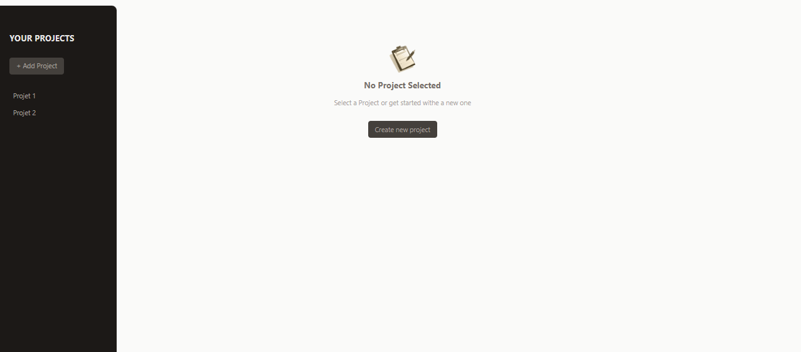
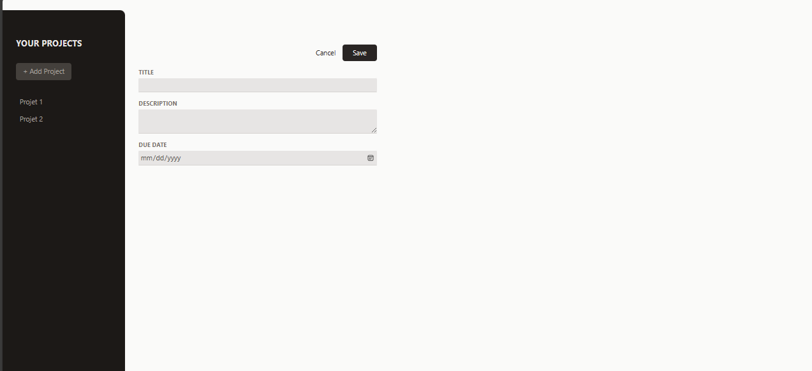
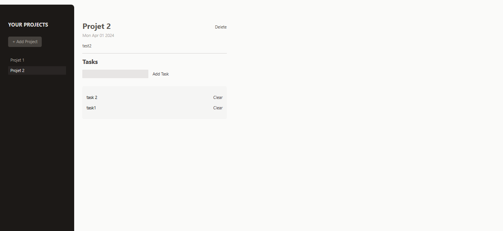

# Project Manager

React Project Manager is a simple web application built with React and Tailwind CSS to help users manage their tasks efficiently. Users can add new tasks, mark tasks as completed, and delete tasks they no longer need.

## Features

- Task creation: Allow users to add new tasks with a title and description.
- Task deletion: Enable users to delete tasks they no longer need.
- Task completion: Allow users to mark tasks as completed.
- Responsive design: Utilize Tailwind CSS for responsive and mobile-friendly user interface.

## Technologies Used

- React: JavaScript library for building user interfaces.
- Tailwind CSS: Utility-first CSS framework for building custom designs.

## About the Developer

**Name:** Ben Hammouda Mohamed Ali  
**Role:** Full Stack Developer (React/.NET)

### Dashboard:

### create new project :

### Add Task:

